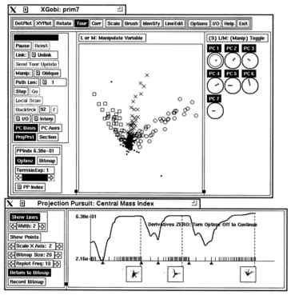
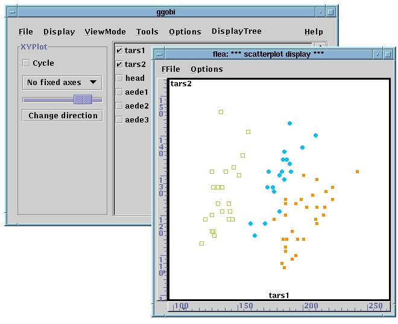
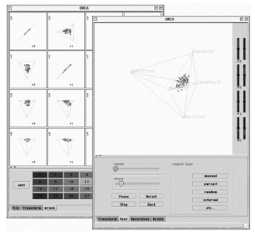
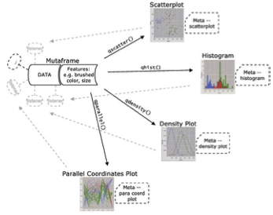
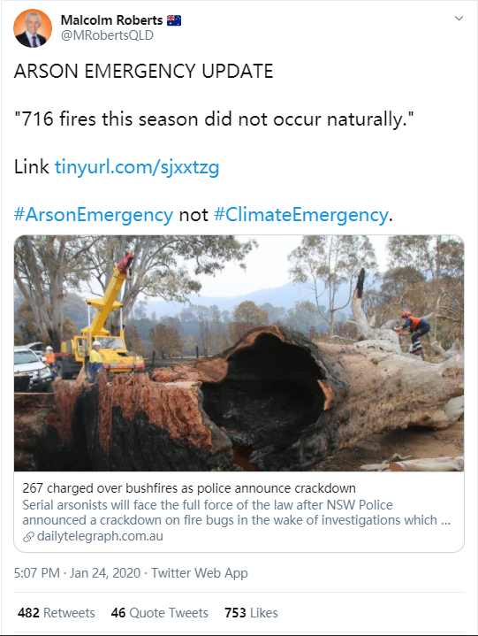
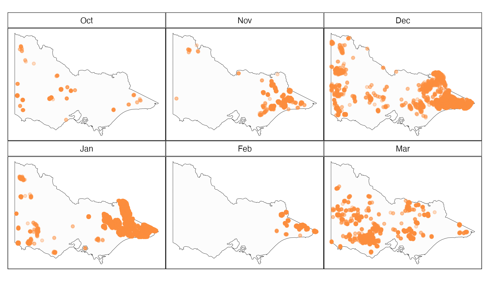
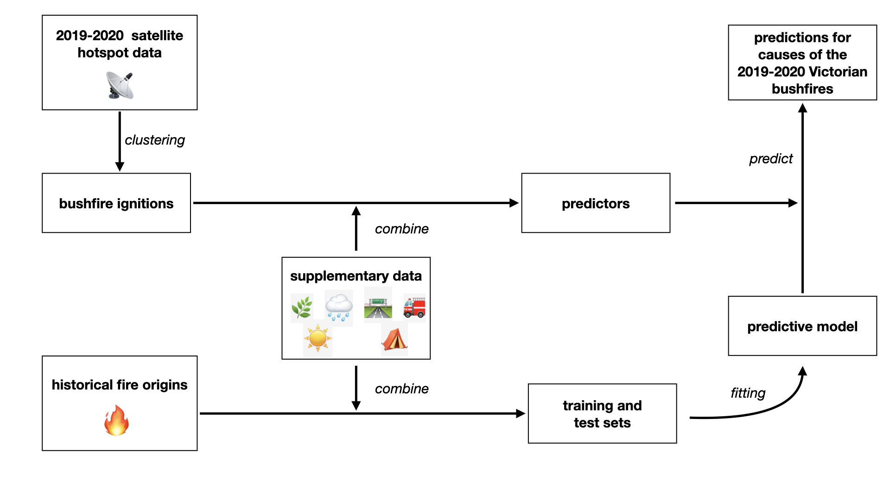
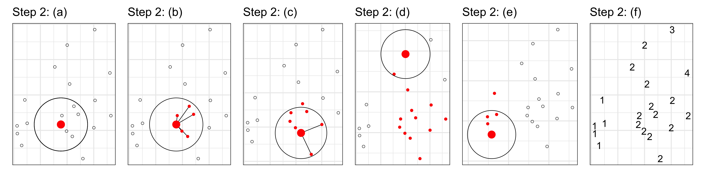
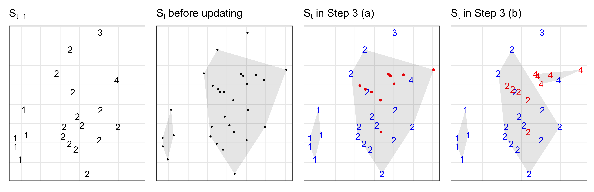
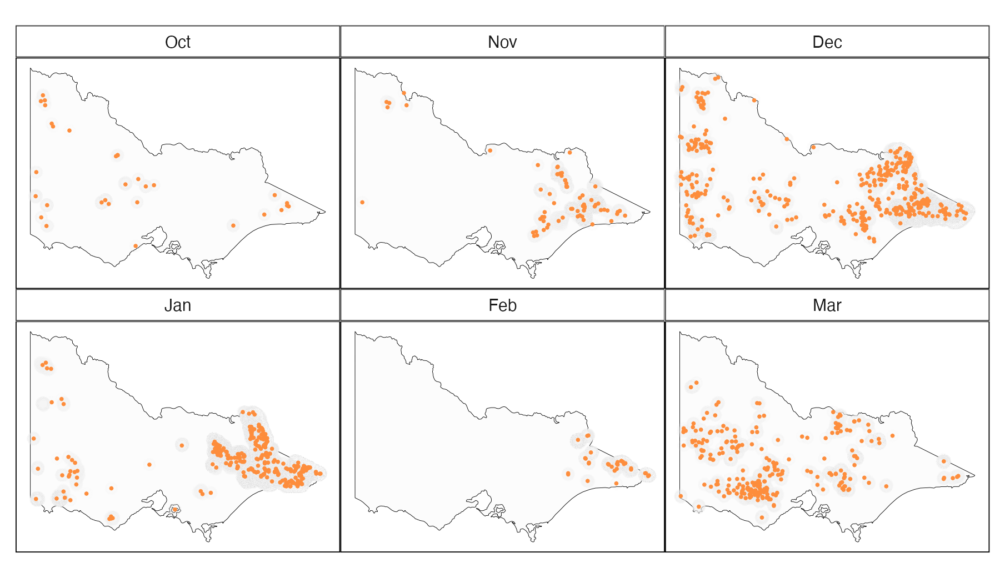

```{r setup, include=FALSE}
knitr::opts_chunk$set(
  echo = FALSE, 
  message = FALSE, 
  warning = FALSE,
  fig.retina = 5)
```

```{r libraries}
library(tidyverse)
library(patchwork)
library(gganimate)
library(ggthemes)
library(plotly)
library(kableExtra)
```

```{r titleslide, child="components/titleslide.Rmd"}
```

```{r themeset}
theme_set(ggthemes::theme_gdocs(base_size = 14) +
            theme(plot.background = 
                    element_rect(fill = 'transparent', 
                                 colour = NA), 
                  axis.line.y = element_line(color = "black",
                                             linetype = "solid"),
                  panel.grid.major = element_line(color = "grey90",
                                             linetype = "solid"),
                  plot.title.position = "plot",
                  plot.title = element_text(size = 18),
                  panel.background  = 
                    element_rect(fill = 'transparent', 
                                 colour = NA),
                  legend.background = 
                    element_rect(fill = 'transparent', 
                                 colour = NA),
                  legend.key        = 
                    element_rect(fill = 'transparent', 
                                 colour = NA)
                  ) )
```

---
class: middle

.pull-left[
  
]

.pull-far-right[

## A little background

Studied mathematics and biochemistry and education in Australia.

Went to New York to be an artist, but did a PhD on statistical graphics.

Moved home to Australia to Monash in 2015 $^1$, and am the only Australian member of the R Foundation.


]

.footnote[.monash-blue2[1 *The Business School probably has the largest concentration of statisticians at Monash*]]

<!-- Talk about art and sport -->

---

## My history in open source software 


```{r fig.width=10, fig.height=4, out.width="90%"}
library(tidyverse)
library(plotly)
library(ggimage)
library(viridis)
library(ggrepel)

software <- data.frame(
  date = c(1989, 1999, 2000, 2009, 
           2010, 2011, 2012, 2018, 
           2019, 2020, 2020, 2021),
  title = c("xgobi 1989 at&t open license", 
            "ggobi 1999 CPL", 
            "orca 2000 LGPL",
            "nullabor 2009 GPL",
            "cranvas 2010 GPL",
            "tourr 2011 MIT",
            "GGally 2012 GPL",
            "suggrants 2018 GPL",
            "tsibble 2019 GPL",
            "sugarbag 2020 MIT",
            "ferrn 2020 MIT",
            "spotoroo 2021 MIT"),
  img = c("images/xgobi.png",
          "images/ggobi.png",
          "images/orca.png", "",
          "images/cranvas.png",
          "", "", "", "", "", "", ""),
  vert = c(0.5, -0.5, 0.6, -0.6, 
           0.7, -0.7, 0.8, -0.8,
           0.9, -0.9, 1, -1),
  type = c("C/XToolkit", "C/gtk", "java/swing", "R", "R/qt", "R", "R", "R", "R", "R", "R", "R")
)

p <- ggplot(software, 
       aes(x=date, y=vert, label=title)) +
  geom_hline(yintercept = 0) +
  geom_segment(aes(x=date, xend = date, y=0, yend=vert)) +
  geom_point(aes(colour = type), size=3) +
  geom_text(aes(colour = type), size=5, 
            nudge_y = c(0.06, -0.06, 0.06, 
                       -0.06, 0.06, -0.06, 
                       0.06, -0.06, 0.06, 
                       -0.06, 0.06, -0.06),
            #nudge_x = c(0.1, 0.1, 0.1, 0.1, 0.1, 0.1, 
            #            -0.1, -0.1, -0.1, -0.1, -0.1, -0.1)
            hjust = c("left", "left", 
                      "left", "right",
                      "right", "left",
                      "left", "right", 
                      "right", "right", 
                      "right", "right")) +
  #scale_colour_viridis_d(option = "magma", end=0.8) +
  scale_colour_brewer("", palette="Dark2") +
  #geom_image(aes(image=img), size=0.2) +
  annotate("text", x=c(1988, 2022), 
           y=c(-0.1, -0.1), 
           label=c("1988", "2022")) +
  theme_solid() +
  theme(axis.text = element_blank(),
        axis.title = element_blank(),
        axis.ticks = element_blank(),
        axis.line = element_blank(), 
        legend.position = "none")
#ggplotly(p, tooltip = "label")
p
```
<br>







---
class: wider
background-image: url(images/glaciers.png)
background-size: 40%
background-position: 95% 50%

.pull-left[
# Involvement in data competitions

- Infovis 2001: Tech bubble boom and bust
- ASA Data expo 2007: Climate change
- ASA Data expo 2009: US air traffic
- Sunlight Foundation 2010: Design for America
]

---
class: transition middle

# Where does open data and open source software get us today? 

---
background-image: url(images/australia_slipping.png)
background-size: cover


---
background-image: url(images/australia_slipping.png)
background-size: cover
count: false

.fill-box[Every time the OECD PISA scores are released there are press articles lamenting the [decline in Australian scores](https://theconversation.com/vital-signs-australias-slipping-student-scores-will-lead-to-greater-income-inequality-128301). And how badly Australian girls perform in math relative to boys.]

---
count: false

```{r fig.width=8, fig.height=6, fig.align="center", out.width="80%"}
library(learningtower)
if (!file.exists("data/student.rda")) {
  student <- load_student("all")
  save(student, file="data/student.rda")
} else {
  load("data/student.rda")
}

# compute original estimate of average and join
all_avg <- student %>%
    select(year, country, math, read, science, stu_wgt) %>%
    na.omit() %>%
    pivot_longer(c(math, read, science), 
                 names_to = "subject", 
                 values_to = "score") %>%
    group_by(country, year, subject) %>%
    summarise(
      avg = weighted.mean(score,
                          w = stu_wgt, na.rm = TRUE),
      .groups = "drop") %>%
  mutate(year = as.numeric(as.character(year))) 

overall_avg <- all_avg %>%
  group_by(year, subject) %>%
  summarise(avg = mean(avg), .groups = "drop")
  
ggplot(all_avg, aes(x = year, 
                    y = avg,
                    group = country)) +
  #geom_point(alpha = 0.45) +
  geom_line(alpha=0.5) +
  geom_line(data=filter(all_avg, country == "AUS"), size=2, colour="#D93F00") +
  geom_line(data=overall_avg, aes(x = year, y = avg), inherit.aes = FALSE, colour = "black", size=2) +
  labs(title = "PISA test scores", 
       x = "", y = "") +
  facet_wrap(~subject, ncol=3) 

```


---
count: false

```{r PISA, fig.width=12, fig.height=6, out.width="100%"}
# See https://github.com/priya51096/paper-learningtower
# For code to compute the confidence intervals
load("data/math_diff_conf_intervals.rda")
load("data/read_diff_conf_intervals.rda")
load("data/sci_diff_conf_intervals.rda")

# Select countries for readable plot

countries_selected <- c("Qatar", 
                        "Australia", 
                        "Malaysia",
                        "Colombia",
                        "Germany",
                        "Finland",
                        "Singapore",
                        "Canada",
                        "USA",
                        "Morocco",
                        "Indonesia",
                        "Israel",
                        "Greece",
                        "South Korea",
                        "Netherlands",
                        "Poland")

# Plot math
math_plot <- math_diff_conf_intervals %>%
  filter(country_name  %in% countries_selected) %>% 
  ggplot(aes(x=diff, y=country_name,
                        colour = score_class)) +
  geom_hline(data=filter(math_diff_conf_intervals,
                         country_name == "Australia"),
             aes(yintercept=country_name), 
             colour = "#FFFF00", size=4, alpha=0.5) +
  geom_vline(xintercept = 0, color = "#969696") +
  geom_point(size=3) +
  geom_errorbar(aes(xmin = lower, xmax = upper),
                width=0, size=2, alpha=0.7) +
  scale_colour_manual("",
      values = c("boys"="#4d9221",
                 "nodiff"="#C0C0C0",
                 "girls"="#c51b7d")) +
  labs(y = "",
  x = "",
  title = "math"
  ) +
  theme(legend.position="none") +
  annotate("text", x = 50, y = 1, label = "Girls") +
  annotate("text", x = -50, y = 1, label = "Boys") +
  scale_x_continuous(limits = c(-70, 70),
                     breaks = seq(-60, 60, 20),
                     labels = abs(seq(-60, 60, 20)))

read_plot <- read_diff_conf_intervals %>%
  filter(country_name  %in% countries_selected) %>% 
  ggplot(aes(x=diff, y=country_name,
                        colour = score_class)) +
  geom_hline(data=filter(read_diff_conf_intervals,
                         country_name == "Australia"),
             aes(yintercept=country_name), 
             colour = "#FFFF00", size=4, alpha=0.5) +
  geom_vline(xintercept = 0, color = "#969696") +
  geom_point(size=3) +
  geom_errorbar(aes(xmin = lower, xmax = upper),
                width=0, size=2, alpha=0.7) +
  scale_colour_manual("",
      values = c("boys"="#4d9221",
                 "nodiff"="#C0C0C0",
                 "girls"="#c51b7d")) +
  labs(y = "",
  x = "",
  title = "read"
  ) +
  theme(legend.position="none") +
  annotate("text", x = 50, y = 1, label = "Girls") +
  annotate("text", x = -50, y = 1, label = "Boys") +
  scale_x_continuous(limits = c(-70, 70),
                     breaks = seq(-60, 60, 20),
                     labels = abs(seq(-60, 60, 20)))

sci_plot <- sci_diff_conf_intervals %>%
  filter(country_name  %in% countries_selected) %>% 
  ggplot(aes(x=diff, 
             y=country_name,
             colour = score_class)) +
  geom_hline(data=filter(sci_diff_conf_intervals,
                         country_name == "Australia"),
             aes(yintercept=country_name), 
             colour = "#FFFF00", size=4, alpha=0.5) +
  geom_point(size=3) +
  geom_errorbar(aes(xmin = lower, xmax = upper),
                width=0, size=2, alpha=0.7) +
  geom_vline(xintercept = 0, color = "#969696") +
  scale_colour_manual("",
      values = c("boys"="#4d9221",
                 "nodiff"="#C0C0C0",
                 "girls"="#c51b7d")) +
  labs(y = "",
  x = "",
  title = "science"
  ) +
  theme(legend.position="none") +
  annotate("text", x = 50, y = 1, label = "Girls") +
  annotate("text", x = -50, y = 1, label = "Boys") +
  scale_x_continuous(limits = c(-70, 70),
                     breaks = seq(-60, 60, 20),
                     labels = abs(seq(-60, 60, 20)))
math_plot + read_plot + sci_plot
```

Gap between girls and boys.


---
count: false

```{r make_map_data}
math_map_data <- math_diff_conf_intervals  %>%
  dplyr::mutate(country_name = 
    case_when(
      country_name == "Brunei Darussalam" ~ "Brunei",
      country_name == "United Kingdom" ~ "UK",
      country_name %in% c("Macau SAR China", 
                          "B-S-J-Z (China)", 
                          "Hong Kong SAR China") ~
        "China",
       country_name == "Korea" ~ "South Korea",
       country_name == "North Macedonia" ~
        "Macedonia",
       country_name == "Baku (Azerbaijan)" ~ "Baku",
       country_name %in% c("Moscow Region (RUS)",
                           "Tatarstan (RUS)",
                "Russian Federation") ~ "Russia",
       country_name == "Slovak Republic" ~ "Slovakia",
       country_name == "Chinese Taipei" ~ "Taiwan",
       country_name == "United States" ~ "USA",
       TRUE ~ as.character(country_name)))

world_map <- map_data("world") %>%
  filter(region != "Antarctica") %>%
  fortify() %>%
  rename(country_name = region)

math_world_data <- full_join(math_map_data,
                        world_map,
                        by = "country_name")

math_world_data <- math_world_data %>%
  rename(Country = country_name,
         math = diff)

read_map_data <- read_diff_conf_intervals %>%
  dplyr::mutate(country_name = 
    case_when(
      country_name == "Brunei Darussalam" ~ "Brunei",
      country_name == "United Kingdom" ~ "UK",
      country_name %in% c("Macau SAR China", 
                          "B-S-J-Z (China)", 
                          "Hong Kong SAR China") ~
        "China",
       country_name == "Korea" ~ "South Korea",
       country_name == "North Macedonia" ~
        "Macedonia",
       country_name == "Baku (Azerbaijan)" ~ "Baku",
       country_name %in% c("Moscow Region (RUS)",
                           "Tatarstan (RUS)",
                "Russian Federation") ~ "Russia",
       country_name == "Slovak Republic" ~ "Slovakia",
       country_name == "Chinese Taipei" ~ "Taiwan",
       country_name == "United States" ~ "USA",
       TRUE ~ as.character(country_name)))

read_world_data <- full_join(read_map_data,
                        world_map,
                        by = "country_name")

read_world_data <- read_world_data %>%
  rename(Country = country_name,
         read = diff)

math_dat <- math_world_data %>%
  dplyr::select(Country, math, lat, long, group)

read_dat <- read_world_data %>%
  dplyr::select(Country, read, lat, long, group)
```

```{r math_map, fig.width=10, fig.height=5.5, fig.align="center", out.width="110%"}
math_map <- ggplot(math_dat,
       aes(x = long,
           y = lat,
           group = group)) +
  geom_polygon(aes(fill = math), 
               colour = "grey90", size=0.5) +
  scale_fill_distiller(palette = "PiYG", 
                       limits = c(-65, 65), 
                       na.value = "white", 
                       guide = "legend") +
  theme_map() +
  theme(aspect.ratio = 0.56, 
        legend.position = "bottom", 
        legend.direction = "horizontal") +
  ggtitle("math (weighted average)")

math_map
```

---
count: false

```{r read_map, fig.width=10, fig.height=5.5, fig.align="center", out.width="110%"}
read_map <- ggplot(read_dat,
       aes(x = long,
           y = lat,
           group = group)) +
  geom_polygon(aes(fill = read), 
               colour = "grey90", size=0.5) +
  scale_fill_distiller(palette = "PiYG", 
                       limits = c(-65, 65), 
                       na.value = "white", 
                       guide = "legend") +
  theme_map() +
  theme(aspect.ratio = 0.56, 
        legend.position = "bottom", 
        legend.direction = "horizontal") +
  ggtitle("read (weighted average)")

read_map
```

---
count: false

# 🏫 Getting the data

<br> <br> <br>

- [OECD PISA](https://www.oecd.org/pisa/): Testing of 15 yr olds conducted every three years since 2000, from 43 to now 90 countries, and from 125k to now 600k students
- `learningtower` package in R (Wang, Yacobellis, Siregar, Romanes, Fitter, Valentino Dalla Riva, Cook, Tierney, Dingorkar, 2021)

---


Who do you believe? Is it lightning 🌩️ or 🔥 arson?


<a href="https://twitter.com/MRobertsQLD/status/1220588928706568193">  </a>


---
count: false
# 📂 Data Sources

.monash-red2[**🔥 Historical fire origins**]: 2000-2019 .font_my_2[[Department of Environment, Land, Water and Planning](https://discover.data.vic.gov.au/dataset/fire-origins-current-and-historical)]

.monash-red2[**📡 Remote sensing data**]: .font_my_2[[Japan Aerospace Exploration Agency](https://www.eorc.jaxa.jp/ptree/userguide.html)]

.font_my[
**Wind speed data**: 1-day, 7-day, ..., 2-year averages from .font_my_2[[Commonwealth Scientific and Industrial Research Organisation and Automated Surface Observing System](https://doi.org/10.25919/5c5106acbcb02)]

**Temperature, Rainfall and Solar exposure**: 1-day, 7-day , 14-day, 28-day, ..., 720-day averages computed from .font_my_2[[Bureau of Meteorology](https://CRAN.R-project.org/package=bomrang)]

**Fuel layer**: Forest type, forest height class, forest crown cover from .font_my_2[[Australian Bureau of Agricultural and Resource Economics](https://www.agriculture.gov.au/abares/forestsaustralia/forest-data-maps-and-tools/spatial-data/forest-cover)]

**Road map**: Proximity to the nearest road using .font_my_2[[OpenStreetMap](%20https://www.openstreetmap.org%20)]

**Fire stations**: Proximity to the nearest CFA station  .font_my_2[[Department of Environment, Land, Water and Planning](https://discover.data.vic.gov.au/dataset/cfa-fire-station-vmfeat-geomark_point)]

**Recreation sites**: Proximity to the nearest camping site .font_my_2[[Department of Environment, Land, Water and Planning](https://discover.data.vic.gov.au/dataset/recreation-sites)]
]

---
count: false
# 📡 Remote sensing data

Japan Aerospace Exploration Agency  provides a hotspot product (reflected energy from the earth) taken from the **Himawari-8** satellite, access as described in [Williamson gist](https://gist.github.com/ozjimbob/80254988922140fec4c06e3a43d069a6)


```{r}
if (!file.exists("images/hotspots_before.png")){
  library(rnaturalearth)
  library(ggthemes)
  library(lubridate)
  au_map <- ne_states(country = 'Australia', returnclass = 'sf')
  vic_map <- au_map[7,]
  VIC_hotspots_before_clustering <- read_csv("data/VIC_hotspots_before_clustering.csv") %>%
    mutate(date = as.Date("2019-10-01") + hours(time_id)) %>%
    mutate(month = month(date, label = TRUE)) %>%
    mutate(month = factor(month, levels = c("Oct", "Nov", "Dec", "Jan", "Feb", "Mar")))

  p <- ggplot(VIC_hotspots_before_clustering) +
    geom_sf(data = vic_map, fill = "grey99", 
            colour = "black", size=0.1) +
    geom_point(aes(lon, lat), size = 1, 
               alpha=0.3, colour = "#fd8d3c") +
    facet_wrap(~month, ncol=3) +
    theme_map() + 
    theme(strip.background = element_rect(fill="white"),
          panel.border = element_rect(colour="black", fill=NA))
  
  ggsave(p, filename = "images/hotspots_before.png", height = 3.5, width = 6, dpi = 300)
}
```




---
count: false

# 💻 Data fusion




---
count: false
# Detect ignitions by clustering hotspot data





Algorithm available in the `spotoroo` package (Li, Cook, Dodwell, 2021) and documented [here](https://github.com/TengMCing/Hotspots-Clustering-Algorithm/tree/master/paper-RJ).

---
count: false
# 💻 Estimated ignition spots

76,000 hotspots reduced to 1,000 ignition sites.

```{r}
if (!file.exists("images/hotspots_after.png")){
  library(rnaturalearth)
  library(ggthemes)
  library(lubridate)
  au_map <- ne_states(country = 'Australia', returnclass = 'sf')
  vic_map <- au_map[7,]
  VIC_hotspots_before_clustering <- read_csv("data/VIC_hotspots_before_clustering.csv") %>%
    mutate(date = as.Date("2019-10-01") + hours(time_id)) %>%
    mutate(month = month(date, label = TRUE)) %>%
    mutate(month = factor(month, levels = c("Oct", "Nov", "Dec", "Jan", "Feb", "Mar")))

  p <- ggplot(VIC_hotspots_before_clustering) +
    geom_sf(data = vic_map, fill = "grey99", 
            colour = "black", size=0.1) +
    geom_point(aes(lon, lat), size = 2, 
               alpha=0.05, colour = "grey90") +
    facet_wrap(~month, ncol=3) +
    theme_map() + 
    theme(strip.background = element_rect(fill="white"),
          panel.border = element_rect(colour="black", fill=NA))
  
  VIC_hotspots_after_clustering <- read_csv("data/VIC_hotspots_after_clustering.csv")
  hotspots <- read_csv("data/VIC_hotspots_raw.csv")
  
  VIC_hotspots_before_clustering$fire_id <- VIC_hotspots_after_clustering$fire_id
  VIC_hotspots_before_clustering$date <- hotspots$`#obstime`
  
  VIC_hotspots_after_clustering <- VIC_hotspots_before_clustering %>%
    group_by(fire_id) %>%
    summarise(time_id = min(time_id)) %>%
    left_join(VIC_hotspots_before_clustering) %>%
    group_by(fire_id, time_id) %>%
    summarise(lon = mean(lon), lat = mean(lat), 
              date = mean(date)) %>%
    mutate(month = month(date, label = TRUE)) %>%
    mutate(month = factor(month, levels = c("Oct", "Nov", "Dec", "Jan", "Feb", "Mar")))
  
  p <- p +
    geom_point(data = VIC_hotspots_after_clustering, 
               aes(lon, lat), alpha = 1, 
               size = 0.2, colour="#fd8d3c") 
  
  ggsave(p, filename = "images/hotspots_after.png", height = 3.5, width = 6, dpi = 300) 
}

```



<!--  -->


---
count: false

# 🔎  **Prediction for 2019-2020 Australia bushfires**


```{r out.width="100%"}
library(ggthemes)
library(rnaturalearth)
library(lubridate)
au_map <- ne_states(country = 'Australia', returnclass = 'sf')
vic_map <- au_map[7,]

read_csv("data/prediction_2019-2020.csv") %>%
  mutate(cause = factor(tools::toTitleCase(cause), levels = c("Lightning", "Accident", "Arson", "Burning_off"))) %>%
  ggplot() +
  geom_sf(data = vic_map, fill = "grey99") +
  geom_point(aes(lon, lat, col = cause, text = paste0("Mon: ", month.abb[month(time)])), size = 1.5, alpha = 1) +
  theme_map(base_size = 20) +
  theme(legend.position = "right") +
  # facet_wrap(~factor(month.abb[month(time)], levels = c("Oct", "Nov", "Dec", "Jan", "Feb", "Mar"))) +
  scale_color_brewer(palette = "RdBu")-> p

library(plotly)


ggplotly(p, tooltip = c("colour", "text"))

```

---
count: false
# 🔎 What we learned

.monash-blue[- Majority (82%) of the bushfires in 2019-2020 season were caused by **lightning**.]
- 138 bushfires caused by accidents which took up 14% of the total fires. Most of them were ignited in March. 
- 37 bushfires (4%) were caused by arsonists, and over half of them were in March.
- Very few planned burns were predicted after October 2019 which model is doing the right thing.

<br>

```{r}
read_csv("data/prediction_2019-2020.csv") %>%
  mutate(cause = factor(tools::toTitleCase(cause), levels = c("Lightning", "Accident", "Arson", "Burning_off"))) %>%
  mutate(month = factor(month.abb[month(time)], levels = c("Oct", "Nov", "Dec", "Jan", "Feb", "Mar"))) %>%
  group_by(cause, month) %>%
  count() %>%
  ungroup() %>%
  rename(Cause = cause) %>%
  spread(month, n) -> temp

temp[is.na(temp)] <- 0

temp$Total <- temp$Oct + temp$Nov + temp$Dec + temp$Jan + temp$Feb + temp$Mar
temp$Total <- paste0(temp$Total, " (", round(temp$Total/sum(temp$Total), 2), ")")

temp  %>%
  knitr::kable("html", align = c('l', 'r', 'r', 'r', 'r', 'r', 'r', 'r'))  %>%
  kable_classic(full_width = F, html_font = "Cambria") %>%
  kable_styling(font_size = 20)
  
```

---
count: false
# Shiny app: https://ebsmonash.shinyapps.io/VICfire/

```{r out.width="110%"}
knitr::include_app("https://ebsmonash.shinyapps.io/VICfire/", height = "550px") 
```

---
# Summary

<br><br>
- Open data and open source software have revolutionised data analysis today, 
    - teaching, 
    - understanding the world, 
    - making it accessible to the masses
- AI needs data and software

---
# Discussion questions

Noting use of "AI" as loosely analogous to "predictive analytics"

- Will the .monash-blue2[ability to download open data and use open source software] to check what others are reporting or that AI is behaving itself, continue into the future? 
- Should an AI system be required to provide a .monash-blue2[diagnostic tool], to allow a user to unpack its results? 
- How does AI .monash-blue2[utilise open data]? (e.g. Watson) How should open data usage be acknowledged in reporting results?
- Should there be legal oversight to .monash-blue2[prevent obfuscation] for profit?
- Does a government organisation, like BOM, ABS, have an obligation to citizens to provide the data that they collect .monash-blue2[from citizens to citizens]? 

---
```{r endslide, child="components/endslide.Rmd"}
```


